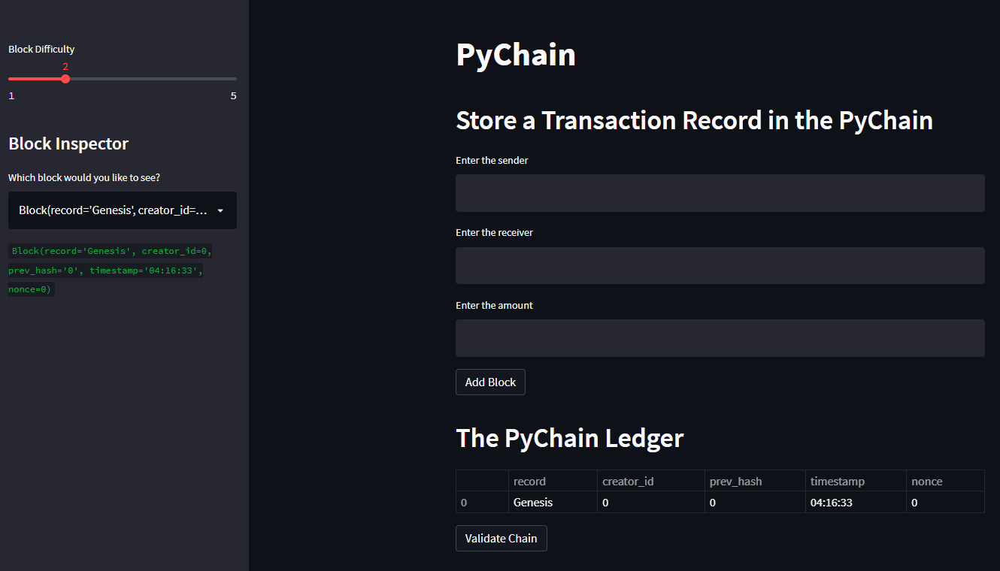
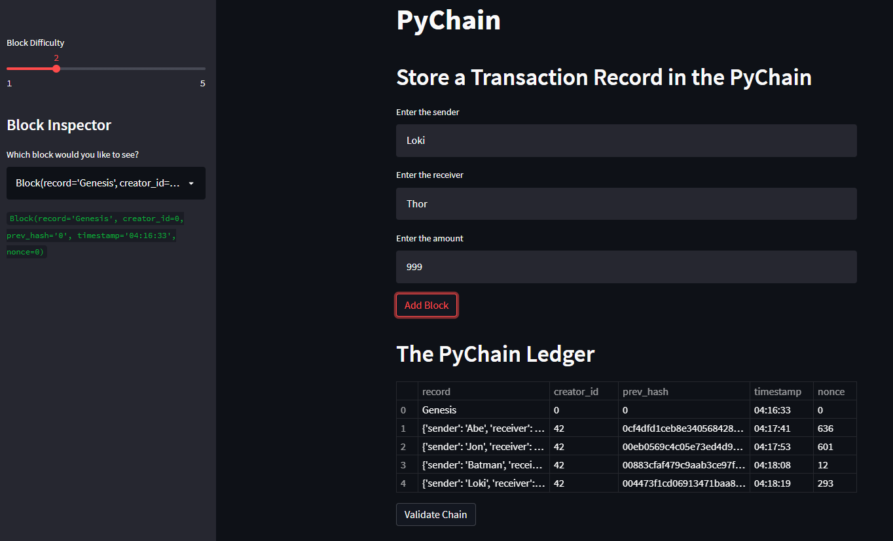
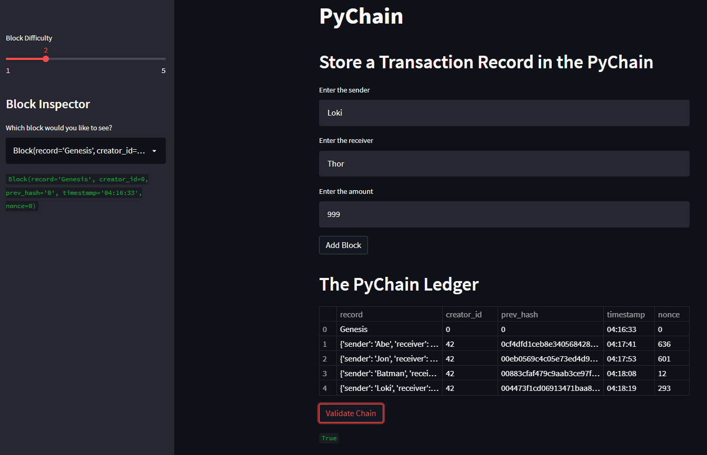

# PyChain Ledger
PyChain Ledger is a demonstration of blockchain-based ledger system with a web-based interface created using Streamlit Library in python.

_________________________________________________________________________________________________________________________________________

### Streamlit UI Screenshots

_________________________________________________________________________________________________________________________________________
##### Screeshot before adding any blocks to the pychain ledger.

##### Screeshot after adding blocks to the pychain ledger.

##### Screeshot after Validating the blocks in the pychain ledger.

